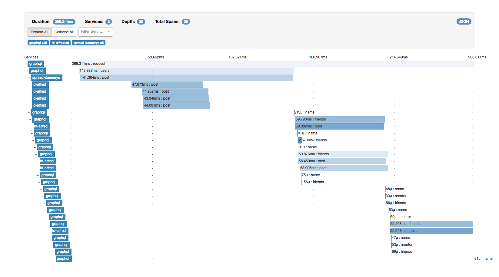

# Apollo Opentracing [](https://badge.fury.io/js/apollo-opentracing) [](https://travis-ci.com/DanielMSchmidt/apollo-opentracing) [](https://github.com/semantic-release/semantic-release) [](#contributors)

Apollo Opentracing allows you to integrate open source baked performance tracing to your Apollo server based on industry standards for tracing.

- 🚀 Request & Field level resolvers are traced out of the box
- 🔍 Queries and results are logged, to make debugging easier
- ⚙️ Select which requests you want to trace
- 🔗 Spans transmitted through the HTTP Headers are picked up
- 🔧 Use the opentracing compatible tracer you like, e.g.
  - [jaeger](https://www.jaegertracing.io/)
  - [zipkin](https://github.com/DanielMSchmidt/zipkin-javascript-opentracing)
- 🦖 Support from node 6 on

## Installation

Run `npm install --save apollo-opentracing` given that you already setup an opentracing tracer accordingly.

## Setup

We need two types of tracer (which could be identical if you like):

- server: Only used for the root (the first span we will start)
- local: Used to start every other span

```diff
const { graphqlExpress } = require("apollo-server-express");
const {serverTracer, localTracer} = require("./tracer");
+const OpentracingExtension = require("apollo-opentracing").default;

app.use(
  "/graphql",
  bodyParser.json(),
  graphqlExpress({
    schema,
+   extensions: [() => new OpentracingExtension({
+     server: serverTracer,
+     local: localTracer,
+   })]
  })
)
```

## Connecting Services



To connect other services you need to use the opentracing [inject](http://opentracing.io/documentation/pages/api/cross-process-tracing.html) function of your tracer.
We pass the current span down to your resolvers as `info.span`, so you should use it.

You can also make use of it and add new logs or tags on the fly if you like.
This may look something like this:

```js
myFieldResolver(source, args, context, info) {
  const headers = {...};

  const parentSpan = info.span;
  // please use the same tracer you passed down to the extension
  const networkSpan = tracer.startSpan("NetworkRequest:" + endpoint, {
    childOf: parentSpan
  });

  // Let's transfer the span information to the headers
  tracer.inject(
    networkSpan,
    YourOpentracingImplementation.FORMAT_HTTP_HEADERS,
    headers
  );

  return doNetworkRequest(endpoint, headers).then(result => {
    networkSpan.finish()
    return result;
  }, err => {
    networkSpan.log({
      error: true,
      errorMessage: err
    });

    networkSpan.finish();
    return err;
  });
}
```

## Selective Tracing

Sometimes you don't want to trace everything, so we provide ways to select if you want to start a span right now or not.

### By Request

If you construct the extension with `shouldTraceRequest` you get the option to opt-in or out on a request basis.
When you don't start the span for the request the field resolvers will also not be used.

The function is called with the same arguments as the `requestDidStart` function extensions can provide, which is documented [here](https://github.com/apollographql/apollo-server/blob/master/packages/graphql-extensions/src/index.ts#L35).

When the request is not traced there will also be no traces of the field resolvers.

### By Field

There might be certain field resolvers that are not worth the tracing, e.g. when they get a value out of an object and need no further tracing. To control if you want a field resolver to be traced you can pass the `shouldTraceFieldResolver` option to the constructor. The function is called with the same arguments as your field resolver and you can get the name of the field by `info.fieldName`. When you return false no traces will be made of this field resolvers and all underlying ones.

## Modifying span metadata

If you'd like to add custom tags or logs to span you can construct the extension with `onRequestResolve`. The function is called with two arguments: span and infos `onRequestResolve?: (span: Span, info: RequestStart)`

## Contributing

Please feel free to add issues with new ideas, bugs and anything that might come up.
Let's make performance measurement to everyone <3

## Contributors

Thanks goes to these wonderful people ([emoji key](https://github.com/kentcdodds/all-contributors#emoji-key)):

<!-- ALL-CONTRIBUTORS-LIST:START - Do not remove or modify this section -->
<!-- prettier-ignore -->
| [<br /><sub><b>Daniel Schmidt</b></sub>](http://danielmschmidt.de/)<br />[💻](https://github.com/DanielMSchmidt/apollo-opentracing/commits?author=DanielMSchmidt "Code") [🤔](#ideas-DanielMSchmidt "Ideas, Planning, & Feedback") | [<br /><sub><b>Ciaran Liedeman</b></sub>](https://github.com/cliedeman)<br />[🐛](https://github.com/DanielMSchmidt/apollo-opentracing/issues?q=author%3Acliedeman "Bug reports") [💻](https://github.com/DanielMSchmidt/apollo-opentracing/commits?author=cliedeman "Code") [⚠️](https://github.com/DanielMSchmidt/apollo-opentracing/commits?author=cliedeman "Tests") | [<br /><sub><b>Jens Ulrich Hjuler Pedersen</b></sub>](http://juhp.net)<br />[🐛](https://github.com/DanielMSchmidt/apollo-opentracing/issues?q=author%3AMultiply "Bug reports") [🤔](#ideas-Multiply "Ideas, Planning, & Feedback") [👀](#review-Multiply "Reviewed Pull Requests") | [<br /><sub><b>Francesca</b></sub>](https://github.com/frances3006)<br />[💻](https://github.com/DanielMSchmidt/apollo-opentracing/commits?author=frances3006 "Code") |
| :---: | :---: | :---: | :---: |
<!-- ALL-CONTRIBUTORS-LIST:END -->

This project follows the [all-contributors](https://github.com/kentcdodds/all-contributors) specification. Contributions of any kind welcome!
